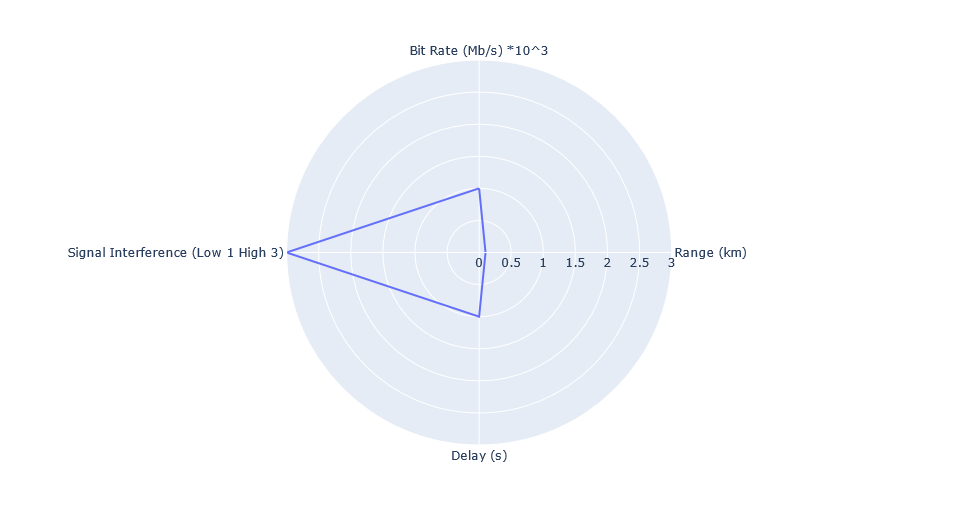

<!DOCTYPE html>

<html>

<head>

<meta charset="utf-8">

</head>

<body>

<h1 align="center">Taxonomy</h1>

L'ensemble du repertoire de Binder ce trouve dans ce lien 

<h2 align="center"> Technology Classification </h2>

Determination des KPIs des differentes technologies utilisées dans notre taxonomie

Liens entre KPI et technologie : 
 

</body>
