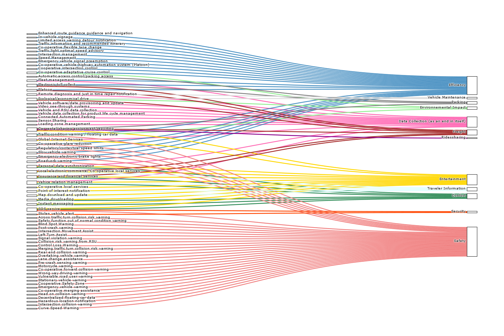
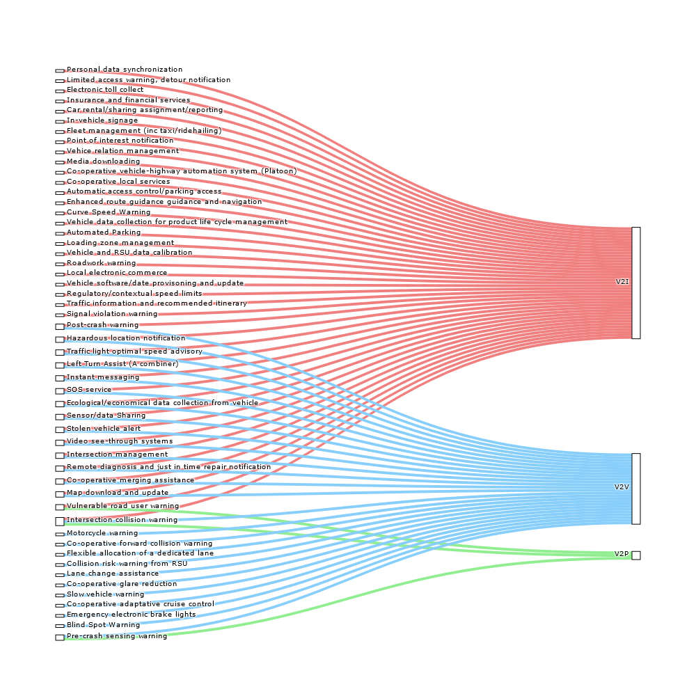
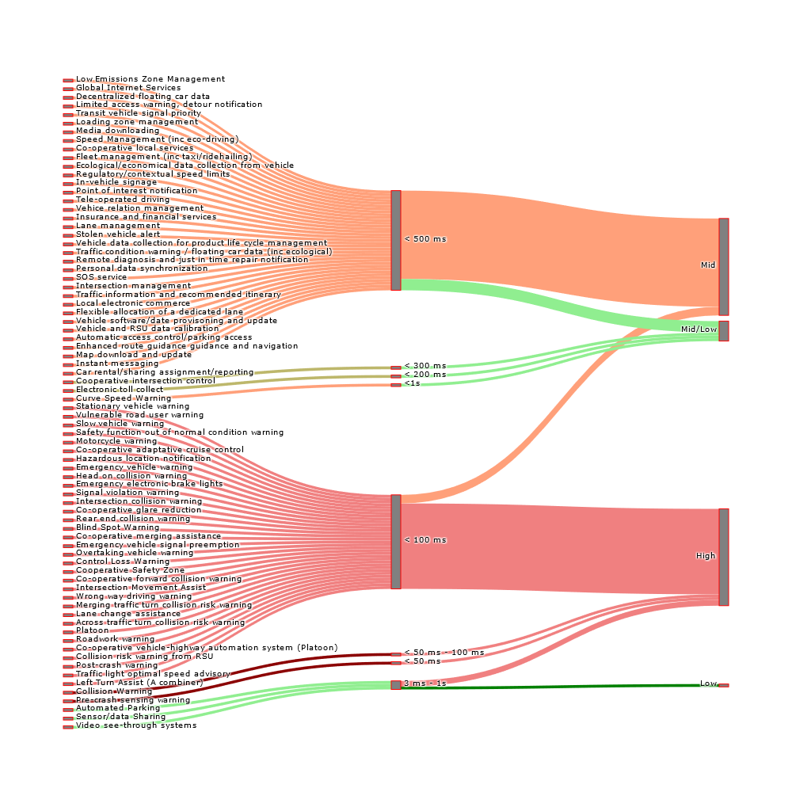
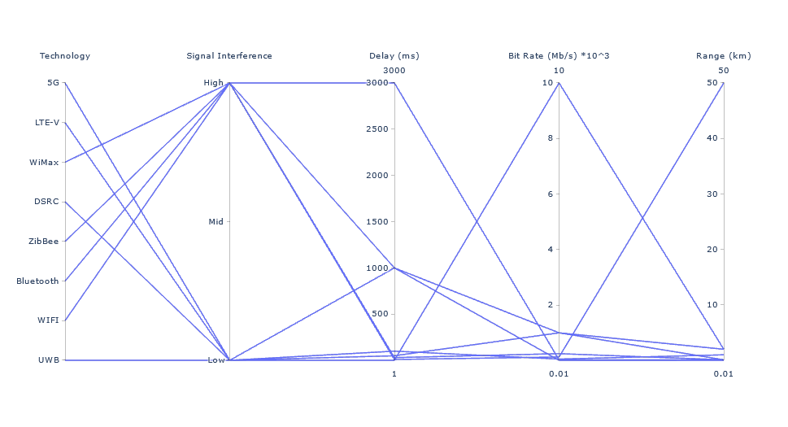
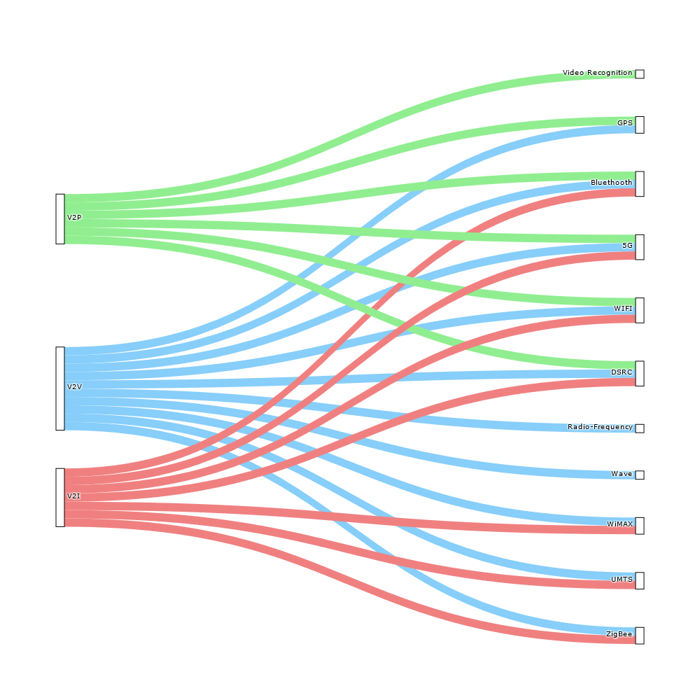

<!DOCTYPE html>

<html>

<head>

<meta charset="utf-8">

</head>

<body>

To access the programs, just click on the images!
<h1 align="center">Taxonomy</h1>

The entire repertoire of Binder can be found in this link 

<h2 align="center"> Transportation application Classification </h2>

 

<h3 align="center"> Application and Communication Mode </h3>  

<h3 align="center"> Application and Priority </h3>  

<h2 align="center"> Technology Classification </h2>

<h3 align="center"> Technology and KPI </h3>
Determination of the KPIs of the different technologies used in our taxonomy

Links between KPI and technology:  

<h3 align="center"> Technology and Communication Mode </h3> 

<

</body>
